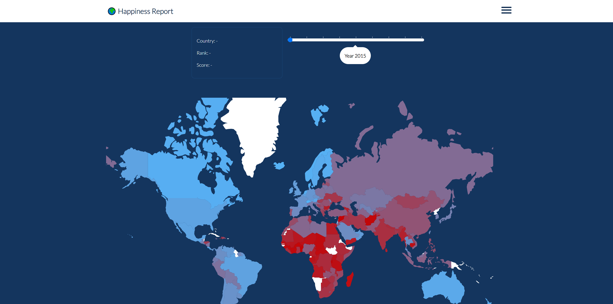
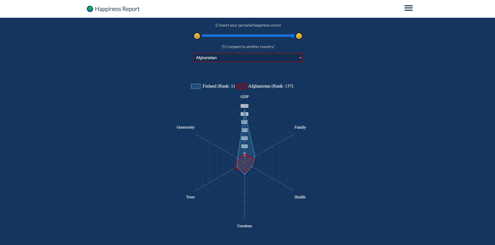
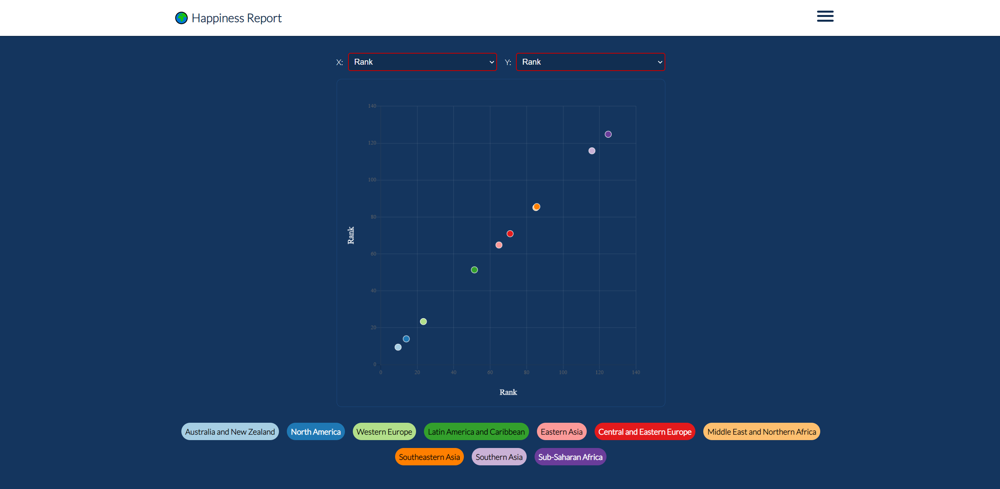

# World Happiness Report








## Project Description

This project contains the code for various web visualisations based on the data of the World Happiness Reports years 2015-2023.
The World Happiness Report is an annual publication that ranks countries based on how happy their citizens perceive themselves to be. It takes into account factors such as income, social support, life expectancy, freedom to make life choices, generosity and trust in government and perceived corruption.

Original Source: [https://worldhappiness.report/](https://worldhappiness.report/)  
Data Source: [https://www.kaggle.com/datasets/mathurinache/world-happiness-report](https://www.kaggle.com/datasets/mathurinache/world-happiness-report)

Website: [https://world-happiness-report.netlify.app/](https://world-happiness-report.netlify.app/)


## Project Requirements and Technologies

The were visualizations made using Vue, D3 and Chart.js.

* `node`
* `npm`

<table>
  <tr>
    <td style="border:none;"></td>
    <td style="border:none;"></td>
    <td style="border:none;"></td>
    <td style="border:none;"></td>
    <td style="border:none;"></td>
  </tr>
 </table>
 
 

## Project Setup

### Installation
```sh
$ npm install
```

### Compile and Hot-Reload for Development
```sh
$ npm run dev
```

### Type-Check, Compile and Minify for Production
```sh
$ npm run build
```


## Project Contributers

This project was created in the "Web Visualization" course as a first-semester project for the master's degree in MultiMediaTechnology at the University of Applied Sciences Salzburg.

Concept and Development by [Isabella Molterer](https://github.com/isabella-molterer) and [Lisa-Maria Eibl](https://github.com/LisaEibl)
